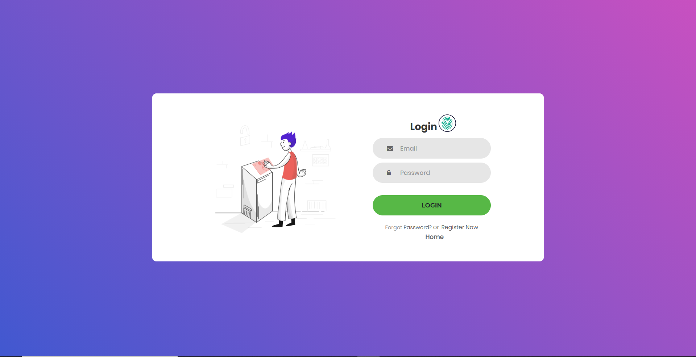
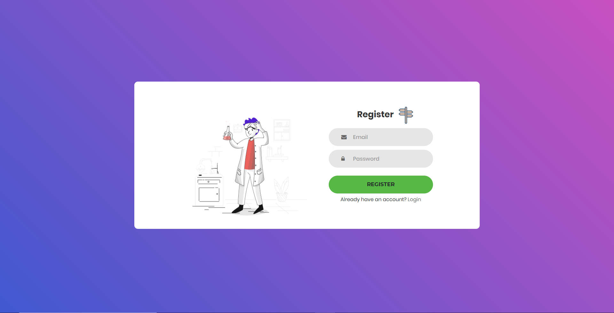

# CENTRAL

A WEB BASED FACIAL ATTENDANCE APPLICATION.

## Description

𝐂𝐞𝐧𝐭𝐫𝐚𝐥, a facial recognition-based attendance taking web application which keeps a record of attendance and classes for every student and prevents third-party entries. It also gives a super easy managing dashboard to the faculty and requires less maintenance.
This web application can cover organizations other than from the education field because it only requires two kinds of users: - 𝐚 𝐇𝐞𝐚𝐝 𝐩𝐞𝐫𝐬𝐨𝐧 (which manages and monitors employees working under him) and 𝐚𝐧 𝐄𝐦𝐩𝐥𝐨𝐲𝐞𝐞 𝐩𝐞𝐫𝐬𝐨𝐧 (which works under the head person). To make an automatic record of attendance of meetings and make meetings for future use, this application can be very handy in daily online meetings/classes.
Main 𝐨𝐛𝐣𝐞𝐜𝐭𝐢𝐯𝐞 of this software is to decrease the managing efforts, make everything automatic and to make online meetings more secure.
We chose a proactive approach to testing so that the testing of individual module was done simultaneously with the deployment. This method helped us to check the individual module for a better implementation of the project.

## Getting Started

## Salient Features

- Easy and simple

- Secure 

- Fast and responsive 

## Tech Stack

- HTML, CSS, Js, Bootstrap

- Face min.js API (Realtime web image/video recogniton)

- Firebase Storage, Authentication and Realtime Database.

### Installing

* You can download this project from the current git repository and run this project on your local host server.
* You can make a pull request if you have any new idea to make it more professional looking site.

### Executing program

* How to run the program. 
   **1.** &ensp; Download our git repository and open in any IDE/Code-Editor like:- Pycharm / Vs code, make sure you are opening the folder as a root folder.&ensp;  
   **2.** Open the index.html using live server on your local host device.&ensp;  
   **3.** Register as a **Student** or a **Teacher** and start using the service.  

## Author

Contributors names and contact info

ex. Shivam Singh (https://www.linkedin.com/in/singhshivam-007/)

## Version History

* 0.1
    * Initial Release

## Screenshots

  
  
  
  

	 
	
	 

## Walkthrough Video and Website link
- Website Link : <a href="https://venemic.github.io/CENTRAL/" target="_blank">Site is active!</a>
- Youtube Demo : <a href="">Soon</a>
